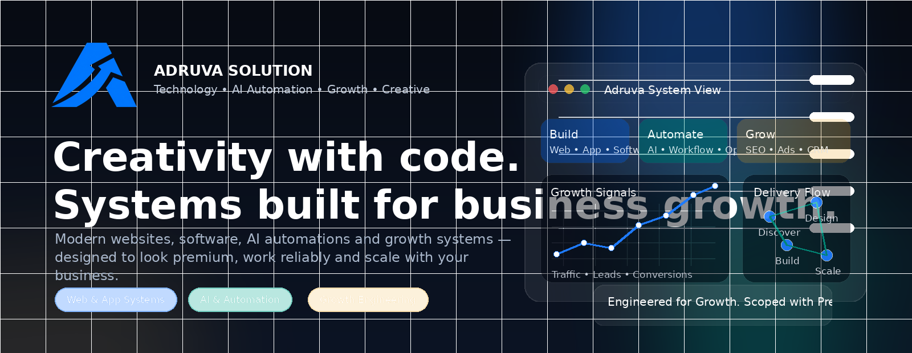
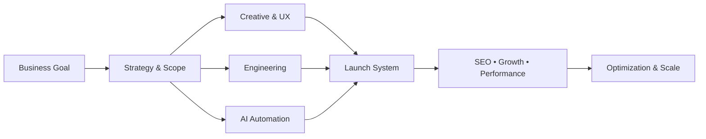
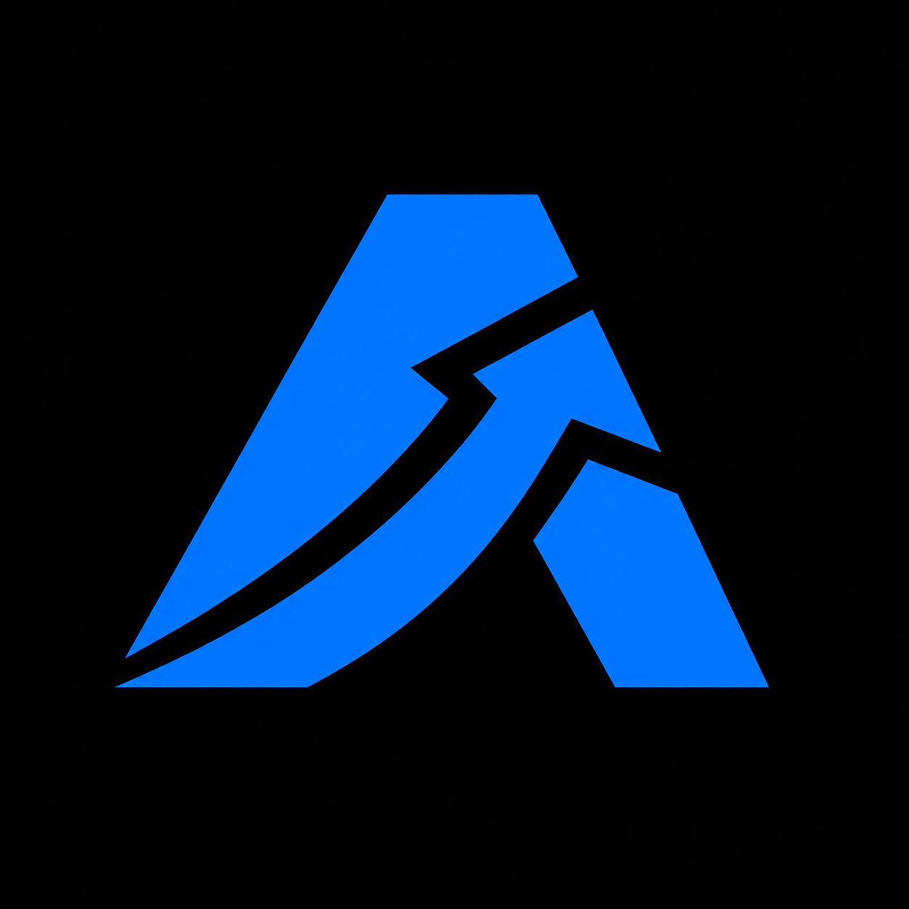

<p align="center">
  
</p>

<p align="center">
  
</p>

<p align="center">
  <a href="https://adruvasolution.com"></a>
  <a href="mailto:info@adruvasolution.com"></a>
  
  
</p>

<h1 align="center">Adruva Solution</h1>
<p align="center"><strong>Creativity with code. Systems built for business growth.</strong></p>

<p align="center">
We help businesses build premium digital experiences, stronger operational systems and measurable growth engines through a combination of <strong>technology</strong>, <strong>AI automation</strong>, <strong>creative execution</strong> and <strong>growth strategy</strong>.
</p>

---

## 🚀 What Adruva Solution does

<table>
<tr>
<td width="50%" valign="top">

### ⚙️ Technology & Engineering
- Business websites and web platforms
- Custom software and internal tools
- Dashboards, admin systems and portals
- Mobile app development
- E-commerce and CMS implementations

</td>
<td width="50%" valign="top">

### 🤖 AI & Automation
- Workflow automation systems
- AI agents and business assistants
- Process optimization and integrations
- Data-assisted operations
- Applied AI for real business use cases

</td>
</tr>
<tr>
<td width="50%" valign="top">

### 📈 Marketing & Growth
- SEO and organic growth systems
- Performance marketing support
- Social media management systems
- Lifecycle and CRM execution
- Analytics, reporting and optimization

</td>
<td width="50%" valign="top">

### 🎨 Creative & Experience
- Brand strategy and digital identity
- UI/UX systems and product design
- Creative design for business communication
- Video and motion support
- Conversion-focused digital experiences

</td>
</tr>
</table>

---

## 🧠 How we think

```text
Strategy → Scope → Design → Build → Automate → Launch → Optimize
```

We do not treat design, engineering and growth as disconnected workstreams. At Adruva Solution, business goals shape the system, the system shapes delivery, and delivery is refined through data and iteration.

---

## 🔷 Adruva operating model



---

## 💼 Why businesses come to us

<table>
<tr>
<td width="33%" valign="top">

### 01. Premium execution
We aim for digital work that looks sharp, feels modern and represents businesses professionally.

</td>
<td width="33%" valign="top">

### 02. Practical systems
We focus on solutions that teams can actually use, maintain and grow with.

</td>
<td width="33%" valign="top">

### 03. Business alignment
Every build is tied to a real outcome — credibility, leads, efficiency, conversion or scale.

</td>
</tr>
</table>

---

## 🛠️ Core working stack

<p>
  
  
  
  
  
  
  
  
  
  
  
  
  
  
  
</p>

<details>
<summary><strong>See our capability breakdown</strong></summary>
<br/>

**Frontend:** React, Next.js, Vue, Nuxt, Angular  
**Backend:** Node.js, NestJS, Fastify, Express, Flask, FastAPI  
**Data & Platform:** PostgreSQL, Supabase  
**Commerce & CMS:** WordPress, WooCommerce, Shopify  
**Business Systems:** dashboards, portals, workflows, admin systems, custom software, automation tools

</details>

---

## 📦 What you can expect from this GitHub

This profile will become a public surface for selected engineering and business-supporting resources such as:

- open-source tools and utilities
- reusable UI or workflow components
- technical experiments and prototypes
- public implementation examples
- documentation and developer notes
- selected non-confidential system patterns

> **Note:** Client-confidential work, internal systems and private delivery assets are intentionally not published here.

---

## 🧭 Repository principles

| Principle | Meaning |
|---|---|
| **Clarity first** | Repositories should be easy to understand and easy to start with. |
| **Maintainable systems** | Clean structure matters more than unnecessary complexity. |
| **Use-case driven** | We build around real business requirements, not trend-chasing. |
| **Performance-minded** | Speed, reliability, SEO and usability are all part of quality. |
| **Automation where useful** | Repetitive work should be simplified through smart systems. |
| **Growth-aware delivery** | Build decisions should support future growth, not block it. |

---

## 🌐 Work with Adruva Solution

If you need a premium website, custom business software, AI-powered workflows, a cleaner digital system or a stronger growth setup, Adruva Solution is built to help you move with clarity.

<p align="center">
  <a href="https://adruvasolution.com"><strong>Visit our website →</strong></a>
  &nbsp;&nbsp;•&nbsp;&nbsp;
  <a href="mailto:info@adruvasolution.com"><strong>Start a conversation →</strong></a>
</p>

---

<p align="center">
  
</p>

<p align="center">
  <sub><strong>Adruva Solution</strong> • Technology • AI Automation • Growth • Creative</sub><br/>
  <sub>Engineered for Growth. Scoped with Precision.</sub>
</p>
